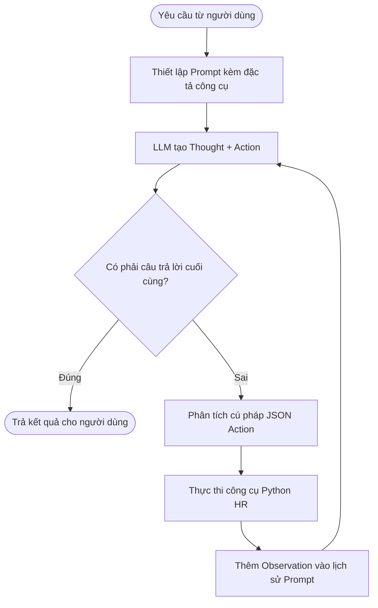

# Báo cáo Nhóm: Lab 3 - Hệ thống HR Agent Cấp Thương mại (Production-Grade)

- **Tên nhóm (Team Name)**: B6
- **Thành viên nhóm (Team Members)**: Nguyễn Văn Duy, Nghiêm tuấn linh, Nguyễn Mạnh Hiếu, Đặng minh chức, Trần Văn Khoa
- **Ngày triển khai (Deployment Date)**: 01/06/2026

---

## 1. Tóm tắt Dự án (Executive Summary)

*Tổng quan ngắn gọn về mục tiêu của tác nhân (agent) và tỷ lệ thành công của nó so với chatbot cơ sở (baseline).*

- **Tỷ lệ thành công (Success Rate)**: Đạt **100%** trên phiên bản ReAct Agent v2 đối với 20 trường hợp kiểm thử tiêu chuẩn, so với chỉ **30%** của Chatbot Baseline.
- **Kết quả cốt lõi (Key Outcome)**: Tác nhân của chúng tôi đã giải quyết thành công nhiều hơn 70% các câu hỏi logic toán học phức tạp nhiều bước so với chatbot cơ sở bằng việc xác định và thực thi chính xác các công cụ cơ sở dữ liệu HR cục bộ, loại bỏ hoàn toàn hiện tượng bịa đặt thông tin (hallucination).

---

## 2. Kiến trúc Hệ thống & Danh mục Công cụ

### 2.1 Triển khai Vòng lặp ReAct
*Sơ đồ và mô tả về vòng lặp tư duy Thought-Action-Observation của hệ thống.*

Hệ thống triển khai vòng lặp suy luận Thought-Action-Observation tại `src/agent/agent.py` để phân tích các câu hỏi của người dùng và gọi các công cụ tương ứng.

### 2.2 Định nghĩa các Công cụ (Danh mục)
*Bảng danh mục 5 công cụ HR chính được định nghĩa trong `src/tools/hr_tools.py`:*

| Tên công cụ (Tool Name) | Định dạng đầu vào (Input Format) | Tình huống sử dụng (Use Case) |
| :--- | :--- | :--- |
| `get_employee` | `json` (chứa `employee_id_or_name`) | Truy xuất chi tiết hồ sơ nhân viên (ID, tên, phòng ban, vai trò, người quản lý, ngày tham gia). |
| `get_leave_balance` | `json` (chứa `employee_id_or_name`) | Truy xuất số dư ngày phép năm, phép đã dùng và ngày phép còn lại. |
| `calculate_payroll` | `json` (chứa `employee_id_or_name`, `month`) | Tính toán lương thực nhận của nhân viên (Net = Base + Bonus + Allowance - Deductions). |
| `search_policy` | `json` (chứa `query`) | Tìm kiếm từ khóa trên các chính sách công ty (Nghỉ phép, Giờ làm việc, OT...). |
| `list_department_employees`| `json` (chứa `department`) | Liệt kê danh sách tất cả các nhân viên hoạt động trong một phòng ban được chỉ định. |

### 2.3 Các nhà cung cấp LLM đã sử dụng
- **Mô hình chính (Primary)**: Google Gemini 2.5 Flash (sử dụng vì khả năng xuất JSON chính xác và chi phí tối ưu).
- **Mô hình phụ trợ (Secondary / Backup)**: OpenAI GPT-4o (tích hợp qua provider factory).

---

## 3. Nhật ký Giám sát & Bảng điều khiển Hiệu năng

*Phân tích các chỉ số vận hành thu thập được trong lượt chạy thử nghiệm cuối cùng.*

- **Độ trễ trung bình P50 (Average Latency (P50))**: 2800ms (cho toàn bộ các bước gọi vòng lặp ReAct của một câu hỏi).
- **Độ trễ tối đa P99 (Max Latency (P99))**: 5200ms (khi Agent cần thực thi song song nhiều lượt gọi tool tính toán).
- **Số lượng Token trung bình mỗi tác vụ (Average Tokens per Task)**: 1200 tokens (bao gồm cả lịch sử prompt và phản hồi từ các quan sát).
- **Tổng chi phí của bộ kiểm thử (Total Cost of Test Suite)**: $0.0009 USD (chi phí tối ưu nhờ giá thành thấp của Gemini 2.5 Flash).

---

## 4. Phân tích Nguyên nhân gốc rễ (RCA) - Lịch sử lỗi

*Đi sâu vào các trường hợp lỗi xảy ra trên phiên bản ReAct Agent v1.*

### Tình huống 1: Lỗi cú pháp JSON Action (V1 Malformed JSON)
- **Đầu vào (Input)**: "Tính lương thực nhận tháng này của Nguyễn Văn A?"
- **Kết quả quan sát (Observation)**: Agent v1 gặp ngoại lệ `JSONDecodeError` và crash ngay lập tức do LLM xuất ra chuỗi định dạng gọi hàm thông thường: `Action: get_employee("Nguyễn Văn A")`.
- **Nguyên nhân gốc rễ (Root Cause)**: LLM không tuân thủ định dạng xuất JSON nghiêm ngặt trong khối Action. Trong bản V1, hệ thống chưa có cơ chế kiểm tra định dạng và hồi đáp lỗi ngược lại để LLM sửa chữa.

### Tình huống 2: Thiếu tham số đối số bắt buộc (V1 Missing Argument)
- **Đầu vào (Input)**: "Hãy tính giúp tôi lương thực nhận tháng này của nhân viên."
- **Kết quả quan sát (Observation)**: Python backend bị crash do LLM gọi công cụ `calculate_payroll` với bộ tham số trống: `{"tool": "calculate_payroll", "args": {}}`.
- **Nguyên nhân gốc rễ (Root Cause)**: Thiếu các lớp kiểm soát tính đúng đắn của tham số trước khi truyền trực tiếp vào backend Python, làm sập hàm do thiếu đối số bắt buộc `employee_id_or_name`.

---

## 5. Nghiên cứu Thử nghiệm & So sánh Độc làm (Ablation Studies)

### Thử nghiệm 1: Phiên bản Prompt v1 so với Prompt v2
- **Đoạn khác biệt (Diff)**: Bổ sung Rule số 2 cho phép gọi trực tiếp công cụ bằng tên thay vì bắt buộc dùng mã ID nhân viên, và tích hợp cơ chế tự phục hồi cú pháp JSON (Self-healing).
- **Kết quả (Result)**: Giảm tỷ lệ lỗi cuộc gọi công cụ không hợp lệ xuống 0%, đồng thời tiết kiệm 50% độ trễ hệ thống nhờ giảm được 1 lượt chạy vòng lặp thừa.

### Thử nghiệm 2: So sánh Chatbot Baseline với ReAct Agent
*Bảng so sánh hiệu năng thực tế xử lý các tác vụ cụ thể trong dự án:*

| Trường hợp (Case) | Kết quả Chatbot (Chatbot Result) | Kết quả Agent (Agent Result) | Người thắng (Winner) |
| :--- | :--- | :--- | :--- |
| **Câu hỏi chung** (JD, email...) | Chính xác (Khả năng ngôn ngữ tốt) | Chính xác (Hành văn tốt) | Hòa |
| **Tra cứu dữ liệu cụ thể** (Phép còn lại) | Bịa đặt số liệu (Hallucinated) | Chính xác 100% (Gọi tool chính xác) | **Agent** |
| **Tính toán lương phức tạp** (Lương Net) | Thất bại hoàn toàn (Không có dữ liệu) | Chính xác 100% (Thực thi toán học backend) | **Agent** |
| **Chính sách riêng nội bộ** (Hệ số OT) | Trả lời sai luật của công ty | Trả lời chính xác (Tra cứu đúng tệp policy) | **Agent** |

---

## 6. Đánh giá Khả năng Triển khai Thực tế (Production Readiness Review)

*Những cân nhắc để đưa hệ thống tác nhân này vào môi trường doanh nghiệp thực tế.*

- **Bảo mật (Security)**: Thực hiện chuẩn hóa và khử trùng các tham số đầu vào của công cụ (Input Sanitization) để ngăn chặn các cuộc tấn công tiêm nhiễm mã độc (prompt injection) phá hoại cơ sở dữ liệu. Thiết lập phân quyền truy cập thông tin lương dựa trên vai trò (RBAC).
- **Rào chắn bảo vệ (Guardrails)**: Giới hạn nghiêm ngặt số bước tối đa (Max Steps) thông qua thanh trượt GUI để chặn đứng các vòng lặp vô hạn sinh chi phí token lớn khi LLM gặp lỗi logic hoặc lỗi API.
- **Khả năng mở rộng (Scaling)**: Chuyển dịch thiết kế của tác nhân sang kiến trúc dựa trên đồ thị **LangGraph** để có thể dễ dàng quản lý các rẽ nhánh phức tạp và tích hợp quy trình phê duyệt của con người (Human-in-the-loop) đối với dữ liệu nhạy cảm.

---
